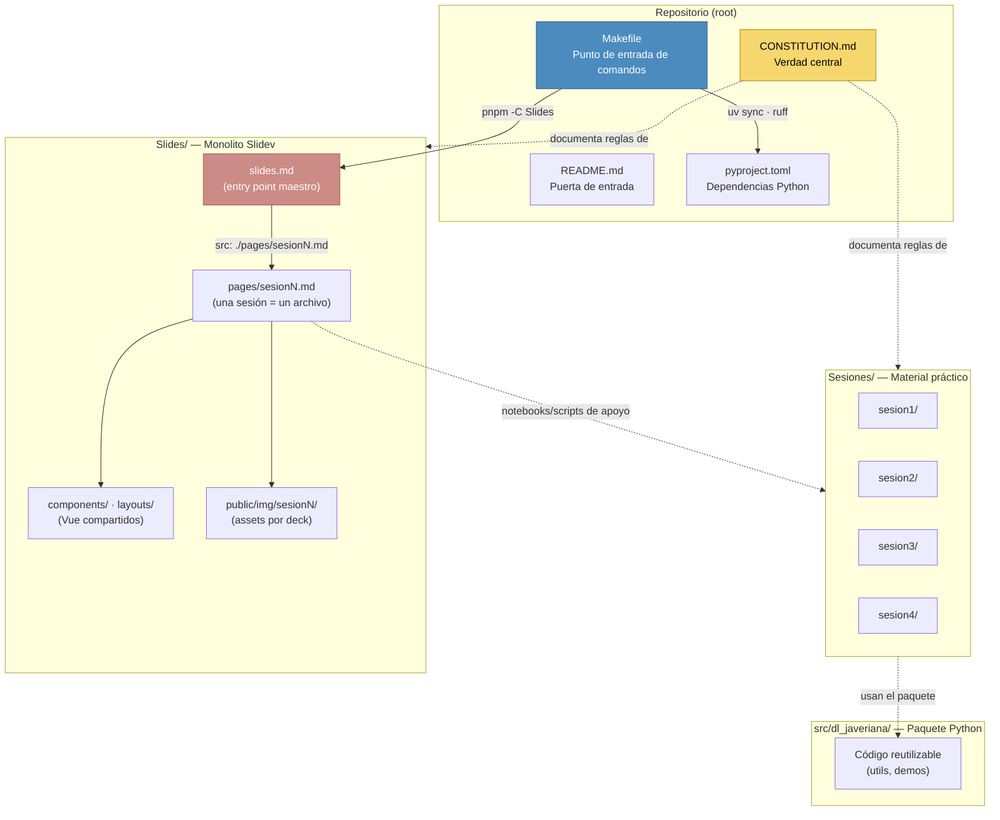

<div align="center">

# 🧠 Deep Learning — Pontificia Universidad Javeriana Cali

**Curso de Deep Learning para pregrado · 4 sesiones × 2 horas**

Tutor: **Jan Polanco Velasco**

[](https://opensource.org/licenses/MIT)
[](https://www.python.org/downloads/)
[](https://docs.astral.sh/uv/)
[](https://pnpm.io/)
[](https://sli.dev/)
[](https://docs.astral.sh/ruff/)
[](https://www.conventionalcommits.org/)
[](CONSTITUTION.md)

</div>

---

## 📖 Tabla de contenidos

1. [¿Qué es este repositorio?](#-qué-es-este-repositorio)
2. [El curso](#-el-curso)
3. [Sesiones](#-sesiones)
4. [Arquitectura](#-arquitectura)
5. [Estructura del proyecto](#-estructura-del-proyecto)
6. [Stack técnico](#-stack-técnico)
7. [Inicio rápido](#-inicio-rápido)
8. [Comandos disponibles](#-comandos-disponibles)
9. [Guía de contribución](#-guía-de-contribución)
10. [Documentación del proyecto](#-documentación-del-proyecto)
11. [Licencia](#-licencia)
12. [Autor](#-autor)

---

## 🔎 ¿Qué es este repositorio?

Repositorio central del **Curso de Deep Learning** dictado en la **Pontificia Universidad Javeriana, sede Cali** (programa de pregrado).

Contiene, de forma versionada y reproducible:

- 🎬 **Presentaciones** construidas con [Slidev](https://sli.dev/) (Markdown + Vue + Tailwind).
- 🧪 **Material práctico** por sesión (notebooks y scripts en `Sesiones/`).
- 🐍 **Código Python reutilizable** empaquetado (`src/dl_javeriana/`).
- 📜 La **`CONSTITUTION.md`**, documento de verdad central que define stack, estructura, reglas de ingeniería y decisiones técnicas del proyecto.

> 💡 Toda decisión relevante (tecnologías, estructura, flujos) se registra y actualiza en la Constitución. Este README es la puerta de entrada pública.

---

## 🎓 El curso

| | |
|---|---|
| **Audiencia** | Estudiantes de pregrado — Pontificia Universidad Javeriana Cali |
| **Modalidad** | 4 sesiones presenciales |
| **Duración** | 2 horas por sesión (8 horas totales) |
| **Tutor** | Jan Polanco Velasco |
| **Enfoque** | Fundamentos y práctica de Deep Learning con Python |

---

## 🗓️ Sesiones

| # | Sesión | Fecha | Contenido | Estado |
|---|--------|-------|-----------|--------|
| 1 | Modelos Auto Regresivos | _Pendiente_ | Regresión lineal/logística, funciones de costo, gradiente descendente, NN fully connected, activaciones, hiperparámetros, datos secuenciales | ✅ Deck |
| 2 | _Pendiente_ | _Pendiente_ | _Pendiente_ | 🔜 |
| 3 | _Pendiente_ | _Pendiente_ | _Pendiente_ | 🔜 |
| 4 | _Pendiente_ | _Pendiente_ | _Pendiente_ | 🔜 |

> Las fechas y contenidos se publicarán aquí y en `CONSTITUTION.md` conforme se confirmen. Cada sesión consta de un deck en `Slides/pages/sesionN.md` y material práctico en `Sesiones/sesionN/`.

---

## 🏗️ Arquitectura

El proyecto sigue un **monolito de presentación** (un solo `Slides/` con un único `package.json`/lockfile) y un **paquete Python** gestionado con `uv`, ambos orquestados por un `Makefile` único en la raíz:



**Reglas de ingeniería clave** (detalle en `CONSTITUTION.md`):

1. **Un solo Slidev**: `Slides/` con un único `package.json` y `pnpm-lock.yaml` determinista. Nada de sub-projects por clase.
2. **Una sesión = un archivo**: `Slides/pages/sesionN.md`, importado por `Slides/slides.md` vía `src:`.
3. **Compartir, no duplicar**: `components/`, `layouts/`, `styles.css` y `setup.ts` son globales.
4. **Comandos centralizados**: todo se ejecuta con `make ...` desde la raíz.

---

## 📁 Estructura del proyecto

```
DL-Javeriana/
├── CONSTITUTION.md          # 📜 Verdad central: stack, reglas, decisiones
├── README.md                # 🚪 Este documento
├── LICENSE                  # ⚖️ MIT
├── Makefile                 # 🔧 Orquestador: targets python-* y slidev-*
├── pyproject.toml           # 📦 Proyecto uv (paquete dl-javeriana)
├── .python-version          # 🐍 3.13 (pin de uv)
├── .gitignore               # Exclusiones (.venv, __pycache__, .DS_Store)
├── Slides/                  # 🎬 Monolito Slidev (todas las presentaciones)
│   ├── slides.md            #    Entry point maestro
│   ├── pages/               #    sesion1.md … sesion4.md
│   ├── components/          #    Componentes Vue compartidos
│   ├── layouts/             #    Layouts personalizados compartidos
│   ├── public/              #    Assets globales + img/sesionN/
│   ├── styles.css           #    Estilos globales
│   └── setup.ts             #    Config global (shortcuts, etc.)
├── Sesiones/                # 🧪 Material práctico por sesión
│   ├── sesion1/
│   ├── sesion2/
│   ├── sesion3/
│   └── sesion4/
└── src/                     # 🐍 Paquete Python reutilizable
    └── dl_javeriana/
        └── __init__.py
```

---

## 🛠️ Stack técnico

| Categoría | Tecnología | Rol |
|-----------|------------|-----|
| **Lenguaje** | Python 3.13 | Código y notebooks del curso |
| **Paquetes Python** | [uv](https://docs.astral.sh/uv/) | Entorno virtual + `pyproject.toml` |
| **Paquetes JS** | [pnpm](https://pnpm.io/) | Dependencias de Slidev |
| **Presentaciones** | [Slidev](https://sli.dev/) | Markdown + Vue + Tailwind |
| **Calidad de código** | [Ruff](https://docs.astral.sh/ruff/) | Linting y formato |
| **Hooks** | pre-commit | Verificación previa al commit *(pendiente de configurar)* |
| **Automatización** | Make | Un único punto de entrada de comandos |
| **UI / Demos** | Streamlit | *Pendiente de confirmar* |
| **Deep Learning / Datos** | _Pendiente_ | Se definirá con el contenido de las sesiones |

---

## 🚀 Inicio rápido

### Prerrequisitos

- [uv](https://docs.astral.sh/uv/getting-started/installation/) (Python ≥ 3.13)
- [pnpm](https://pnpm.io/installation) (Node LTS)
- [Make](https://www.gnu.org/software/make/) (incluido en macOS/Linux)

### 1. Clonar el repositorio

```bash
git clone git@github.com:hamsomp3/deep_learning_javeriana_cali.git
cd deep_learning_javeriana_cali
```

### 2. Entorno Python

```bash
make python-sync   # Crea .venv/ e instala dependencias declaradas
```

### 3. Presentaciones

```bash
make slidev-install   # pnpm install en Slides/
make slidev-dev       # abre http://localhost:3030
```

> El deck maestro es `Slides/slides.md`, que importa cada sesión desde `Slides/pages/sesionN.md`.

### 4. Verificar la configuración disponible

```bash
make help
```

---

## ⌨️ Comandos disponibles

| Target | Descripción |
|--------|-------------|
| `make help` | Lista todos los targets con su descripción |
| `make python-sync` | Sincroniza el entorno virtual con `pyproject.toml` |
| `make python-add PKG=<paquete>` | Agrega una dependencia Python |
| `make python-lint` | Linting con Ruff (`ruff check . --fix`) |
| `make python-format` | Formatea el código con Ruff |
| `make slidev-install` | Instala dependencias Slidev (`pnpm -C Slides install`) |
| `make slidev-dev` | Servidor de desarrollo de diapositivas (`:3030`) |
| `make slidev-build` | Build estático del SPA |
| `make slidev-export OUTPUT=deck.pdf` | Exporta la presentación a PDF |

---

## 🤝 Guía de contribución

### Flujo diario

```bash
git pull --rebase                       # 0. Sincronizar al iniciar
# ...trabajo...
git status                              # 1. Revisar cambios
make slidev-dev                         # 2. Verificar diapositivas
make python-lint && make python-format  # 3. Calidad de código
git add -A
git commit -m "tipo: mensaje descriptivo"
git push
```

### Convención de commits

Este proyecto usa [Conventional Commits](https://www.conventionalcommits.org/):

| Tipo | Uso |
|------|-----|
| `feat:` | Nueva funcionalidad (sesión, componente, demo) |
| `fix:` | Corrección de errores |
| `docs:` | Cambios de documentación (incluida `CONSTITUTION.md`) |
| `refactor:` | Refactorización sin cambio de lógica |
| `style:` | Lint, formato, espacios |
| `chore:` | Mantenimiento y configuración |

### Regla de oro

> Cualquier cambio significativo (nuevas sesiones, tecnologías, arquitecturas o reglas) **debe** reflejarse en `CONSTITUTION.md` dentro del mismo commit.

---

## 📜 Documentación del proyecto

La fuente de verdad de este repositorio es [`CONSTITUTION.md`](CONSTITUTION.md):

- Contexto y alcance del curso
- Directiva de mantenimiento
- Stack técnico y decisiones registradas
- Estructura canónica y reglas de ingeniería de las presentaciones
- Flujo diario y convenciones

Si este README y la Constitución discrepan, **gana la Constitución**.

---

## ⚖️ Licencia

Distribuido bajo la licencia [MIT](LICENSE). Puedes usar, modificar y redistribuir el material citando la autoría.

---

## 👤 Autor

**Jan Polanco Velasco**

- GitHub: [@hamsomp3](https://github.com/hamsomp3)

<p align="center">
  Hecho con 🐍 + ☕ para los estudiantes de la Javeriana Cali.
</p>
