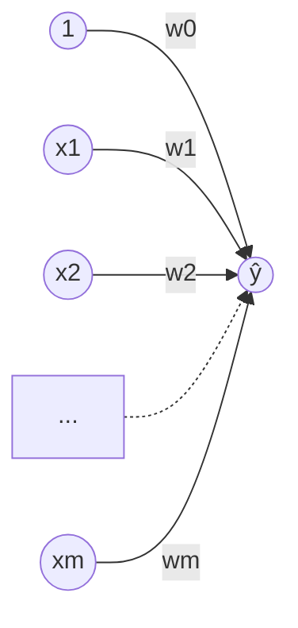
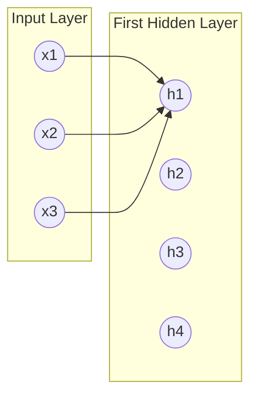
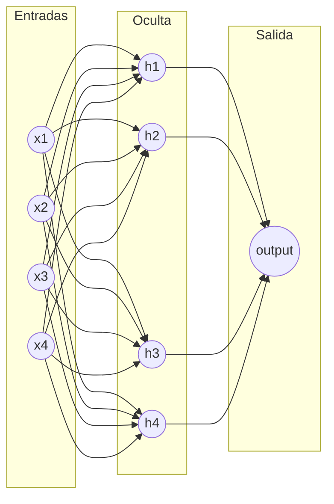
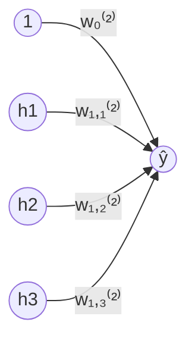
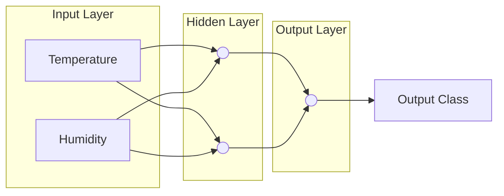

<v-click>

# Modelos Auto Regresivos

</v-click>

<v-click>

**Jan Polanco Velasco**

</v-click>


---
layout: two-cols
---

<v-click>

# Modelos Auto Regresivos

</v-click>

<v-clicks>

- [Regresión Lineal](https://www.researchgate.net/figure/Different-types-of-Machine-Learning-algorithms_fig3_373838363)
- Función de costo
- Gradiente descendente
- Regresión Lineal multivariada
- Regresión Logística

</v-clicks>

::right::

<v-clicks>


</v-clicks>

---
layout: two-cols
---

<v-click>

# Modelos Auto Regresivos

</v-click>

<v-click>

### Regresión Lineal

</v-click>

<v-clicks>

- **Relación lineal:** Este modelo describe una relación lineal entre las entradas $x$ y las salidas $y$.
- Donde $w_0$ y $w_1$ *(weights)* representan el intercepto y la pendiente de la recta, respectivamente.
- Los pesos pueden tomar cualquier valor.
- Diferentes pesos producen diferentes rectas.
- Es necesario calcular la función de costo *(para encontrar los mejores pesos)*.

</v-clicks>

<v-clicks>

$$y = w_0 + w_1 \cdot x$$

</v-clicks>

::right::

<v-clicks>


</v-clicks>


---
layout: two-cols
---

<v-click>

# Modelos Auto Regresivos

### Función de costos

</v-click>

<v-clicks>


$$y = w_0 + w_1 \cdot x$$

</v-clicks>

::right::

<v-clicks>


</v-clicks>

---
layout: two-cols
---

<v-click>

# Modelos Auto Regresivos

### Función de costos

</v-click>

<v-clicks>

- Los pesos pueden tomar cualquier valor.
- Diferentes pesos producen diferentes rectas.
- Es necesario calcular la función de costo *(Los mejores pesos)*.
- **La función de costo (asumiendo $w_0$ conocido):**

$$\mathcal{L}(w_1) = \sum_{i=1}^{N} (w_1 \cdot x_i - y_i)^2$$

</v-clicks>

::right::

<v-clicks>

<!-- Curva convexa de costo en función de w_1 -->
```
  L(w1) ^
        \           /
         \         /
          \       /
           \__.__/
              |
             w1*    ---> w1
```

</v-clicks>

---
layout: two-cols
---

<v-click>

# Modelos Auto Regresivos

### Gradiente Descendente

$$\mathcal{L}(w_1) = \sum_{i=1}^N (w_1 \cdot x_i - y_i)^2$$

$$w^{(t+1)} = w^{(t)} - \alpha \nabla f_i(w^{(t)})$$

</v-click>

<v-clicks>

- **$w^{(t+1)}$**: Posición de la siguiente iteración
- **$w^{(t)}$**: Posición del paso anterior
- **$\alpha$**: Tasa de aprendizaje *(learning rate / step size)*
- **$\nabla f_i(w^{(t)})$**: Gradiente en la observación $i$

</v-clicks>

::right::

<v-clicks>

<!-- Gráfica de pasos hacia el mínimo global -->
```
Cost ^
     \  (Paso inicial)
      \ *
       \  *
        \   *
         \    * (Minimum)
          \___*___/ ---> w
```

</v-clicks>

---

<v-click>

# 10 Most Common Loss Functions in Machine Learning

</v-click>

### Regression Loss Functions
| Loss Function | Description | Formula |
|---|---|---|
| **Mean Bias Error (MBE)** | Captures average bias in prediction. Rarely used for training. | $\mathcal{L}_{MBE} = \frac{1}{N} \sum_{i=1}^N (y_i - f(x_i))$ |
| **Mean Absolute Error (MAE / L1)** | Measures absolute average bias in prediction. | $\mathcal{L}_{MAE} = \frac{1}{N} \sum_{i=1}^N \|y_i - f(x_i)\|$ |
| **Mean Squared Error (MSE / L2)** | Average squared distance between actual and predicted. | $\mathcal{L}_{MSE} = \frac{1}{N} \sum_{i=1}^N (y_i - f(x_i))^2$ |
| **Root Mean Squared Error (RMSE)** | Square root of MSE. Same units as target. | $\mathcal{L}_{RMSE} = \sqrt{\frac{1}{N} \sum_{i=1}^N (y_i - f(x_i))^2}$ |
| **Huber Loss** | Combination of MSE and MAE. Parametric robust loss. | $\mathcal{L}_{\delta} = \begin{cases} \frac{1}{2}(y - f(x))^2 & \text{si } \|y - f(x)\| \le \delta \\ \delta(\|y - f(x)\| - \frac{1}{2}\delta) & \text{en otro caso} \end{cases}$ |
| **Log Cosh Loss** | Similar to Huber, non-parametric, twice differentiable. | $\mathcal{L}_{\log\cosh} = \sum_{i=1}^N \log(\cosh(f(x_i) - y_i))$ |

### Classification Loss Functions
| Loss Function | Description | Formula |
|---|---|---|
| **Binary Cross Entropy (BCE)** | Loss function for binary classification tasks. | $\mathcal{L}_{BCE} = -\frac{1}{N} \sum [y_i \log p(x_i) + (1-y_i) \log(1-p(x_i))]$ |
| **Hinge Loss** | Penalizes wrong and low-confidence predictions (SVMs). | $\mathcal{L}_{\text{hinge}} = \max(0, 1 - f(x) \cdot y)$ |
| **Categorical Cross Entropy** | Multi-class classification extension of BCE. | $\mathcal{L}_{CE} = -\frac{1}{N}\sum \sum y_{ij} \log(f(x_{ij}))$ |
| **KL Divergence** | Relative entropy between true and predicted distributions. | $\mathcal{L}_{KL} = \sum y_i \cdot \log\left(\frac{y_i}{f(x_i)}\right)$ |

---
layout: two-cols
---

<v-click>

# Modelos Auto Regresivos

### Gradiente Descendente

</v-click>

<v-clicks>

$$\mathcal{L}(w_1) = \sum_{i=1}^N (w_1 \cdot x_i - y_i)^2$$

$$w^{(t+1)} = w^{(t)} - \alpha \nabla f_i(w^{(t)})$$

</v-clicks>

::right::

<v-clicks>

<!-- Imagen: Superficie 3D de costo con múltiples mínimos locales y la trayectoria del gradiente -->
*(Superficie no convexa $J(\theta_0, \theta_1)$ y trayectoria de convergencia hacia un mínimo)*

</v-clicks>

---
layout: two-cols
---

<v-click>

# Modelos Auto Regresivos

### Gradiente Descendente

</v-click>

<v-clicks>

$$\mathcal{L}(w_1) = \sum_{i=1}^N (w_1 \cdot x_i - y_i)^2$$

$$w^{(t+1)} = w^{(t)} - \alpha \nabla f_i(w^{(t)})$$

</v-clicks>

::right::

<v-clicks>

<!-- Imagen: Superficie 3D ondulada mostrando valles y curvas de nivel -->
*(Superficie de optimización compleja y curvas de nivel en el plano inferior)*

</v-clicks>

---
layout: two-cols
---

<v-click>

# Modelos Auto Regresivos

### Gradiente Descendente

</v-click>

<v-clicks>

$$\mathcal{L}(w_1) = \sum_{i=1}^N (w_1 \cdot x_i - y_i)^2$$

$$w^{(t+1)} = w^{(t)} - \alpha \nabla f_i(w^{(t)})$$

</v-clicks>

::right::

<v-clicks>

<!-- Imagen: Curvas de nivel 2D concéntricas con flechas hacia el centro -->
*(Vista 3D y vista 2D de curvas de nivel convergiendo al centro del elipsoide)*

</v-clicks>

---
layout: two-cols
---

<v-click>

# Modelos Auto Regresivos

### Regresión Lineal Multivariada

</v-click>

<v-clicks>

- Se puede aplicar a datos con **múltiples atributos**.
- Los parámetros del modelo se estiman a partir de los conceptos de **Función de costo** y **Gradiente descendente**.

$$\hat{y} = w_0 + \sum_{j=1}^m w_j \cdot x_j$$

</v-clicks>

::right::

<v-clicks>

<!-- Diagrama: Nodos de entrada x_1 .. x_m con bias a un nodo sumador de salida y_hat -->


</v-clicks>

---
layout: two-cols
---

<v-click>

# Modelos Auto Regresivos

### Regresión Lineal Multivariada

</v-click>

<v-clicks>

- En este caso, la predicción se calcula como una **combinación lineal** de todos los atributos de entrada.

$$\hat{y} = w_0 + \sum_{j=1}^m w_j \cdot x_j$$

</v-clicks>

::right::

<v-clicks>


</v-clicks>

---
layout: two-cols
---

<v-click>

# Modelos Auto Regresivos

### Regresión Logística

</v-click>

<v-clicks>

- Realiza predicciones a partir de una combinación lineal.
- Se mide la probabilidad de que una instancia pertenezca a una de las dos clases (**clasificación binaria**).

$$\hat{y} = p(y = 1 \mid \mathbf{x}) = \sigma \left( w_0 + \sum_{j=1}^m w_j x_j \right)$$

</v-clicks>

*Donde:*
- $\hat{y}$ es la probabilidad de que $y = 1$ dado el vector de atributos $\mathbf{x}$.
- $\sigma(\cdot)$ es la función sigmoide.

::right::

<v-clicks>


</v-clicks>

---
layout: two-cols
---

<v-click>

# Modelos Auto Regresivos

### Regresión Logística

</v-click>

<v-clicks>

- La combinación lineal toma cualquier valor real.
- Para mapear la predicción a una **probabilidad**, se usa la **función sigmoidal**.

$$\hat{y} = p(y = 1 \mid \mathbf{x}) = \sigma \left( w_0 + \sum_{j=1}^m w_j x_j \right)$$

</v-clicks>

*Donde:*
- $\hat{y}$ es la probabilidad de que $y = 1$ dado el vector de atributos $\mathbf{x}$.
- $\sigma(\cdot)$ es la función sigmoide.

::right::

<v-clicks>


</v-clicks>

---

<v-click>

# Modelos Auto Regresivos

### Red Neuronal Fully Connected

</v-click>

<v-clicks>

- **Capa de Entrada** *(Input Layer)*
- **Capa oculta** *(Hidden Layer - $h$)*
- **Capa de salida** *(Output Layer)*

</v-clicks>

<v-click>

### ¿Cuántas capas tiene la NN?
*(Modelo biológico de la neurona: dendritas, soma/núcleo, axón vs modelo artificial de suma ponderada + activación)*

</v-click>

---

<v-click>

# Modelos Auto Regresivos

### Red Neuronal Fully Connected

</v-click>

<v-clicks>

- La capa de entrada **no suele considerarse** en el conteo de capas.
- **Tiene 4 capas:** $L = 4$ *(3 capas ocultas + 1 capa de salida)*.

</v-clicks>

---
layout: two-cols
---

<v-click>

# Modelos Auto Regresivos

</v-click>

<v-clicks>

- El **superíndice** indica la capa.
- $h_1$ necesita $3 + 1$ parámetros.
- La primera capa oculta necesita $4 \times 5$ parámetros.

</v-clicks>

<v-click>

### Ecuación general para $h_1$:
$$h_1 = g\left( w_{1,0}^{[1]} + \sum_{j=1}^3 w_{1,j}^{[1]} x_j \right)$$

- $g(\cdot)$: Función de activación (ReLU, sigmoide, etc.)
- $w_{1,0}^{[1]}$: Bias o término de sesgo.
- $w_{1,j}^{[1]}$: Peso asociado a cada entrada $x_j$.

</v-click>

::right::

<v-clicks>

<!-- Arquitectura: 3 entradas (x1, x2, x3) conectadas a capas ocultas -->


</v-clicks>

---

<v-click>

# Modelos Auto Regresivos

### Red con una capa oculta y salida escalar

</v-click>

<v-click>



</v-click>

---
layout: two-cols
---

<v-click>

# Modelos Auto Regresivos

### Cálculo de la neurona de salida $\hat{y}$

</v-click>

<v-clicks>

$$\hat{y} = g\left( w_{1,0}^{[2]} + \sum_{j=1}^3 w_{1,j}^{[2]} h_j \right)$$

- Ponderación de los estados ocultos $h_1, h_2, h_3$ junto al sesgo $w_{1,0}^{[2]}$.

</v-clicks>

::right::

<v-clicks>



</v-clicks>

---

<v-click>

# Modelos Auto Regresivos

### Funciones de Activación

</v-click>

<v-clicks>

- **Añaden No Linealidad:** Las funciones de activación son esenciales para agregar un componente no lineal en las redes neuronales, permitiendo que estas redes puedan aprender y modelar relaciones complejas en los datos.
- **Modelo Lineal sin Activación:** Sin funciones de activación, una red neuronal se reduce a un simple modelo lineal, sin importar cuántas capas ocultas contenga.
- **En Cualquier Capa:** Las funciones de activación pueden colocarse en cualquier capa de la red.

</v-clicks>

---

<v-click>

# Modelos Auto Regresivos

### Funciones de Activación

</v-click>

<v-clicks>

- Ciertas funciones son más apropiadas para **capas de salida**.
- Otras son mejores para **capas ocultas**, optimizando el rendimiento de la red.

</v-clicks>

<v-click>

### Definición Matemática
Para una unidad en una capa oculta o de salida, el cálculo del valor se realiza mediante la función de activación $g(\cdot)$:

$$h_2 = g\left( w_{2,0}^{[1]} + \sum_{j=1}^4 w_{2,j}^{[1]} x_j \right)$$

</v-click>

---
layout: two-cols
---

<v-click>

# Modelos Auto Regresivos

### Tipos de Funciones de Activación: Identidad

</v-click>

<v-clicks>

- **Función Identidad:** $f(x) = x$
- Salida igual a la entrada.
- Recomendación de la diapo anterior: en capas ocultas produce un modelo puramente lineal (no tiene sentido).
- **Se puede usar para regresión** en la capa de salida.

</v-clicks>

::right::

<v-clicks>

```
        y ^
          |      /
          |     /
          |    /
    ------+---/-----> x
        / |
       /  |
```

</v-clicks>

---
layout: two-cols
---

<v-click>

# Modelos Auto Regresivos

### Tipos de Funciones de Activación: Sigmoide

</v-click>

<v-clicks>

- **Función sigmoide:** $\sigma(x) = \frac{1}{1 + e^{-x}}$
- Rango de valores: $[0, 1]$.
- Se usaba al inicio de las NN, pero introduce problemas de saturación/latencia de gradientes.
- **Softmax** es la versión generalizada para clasificación multiclase en la capa de salida.

</v-clicks>

::right::

<v-clicks>

```
        y ^
      1 --+-----.......
          |    /
    0.5 --+---/
          |  /
    ------+--/-------> x
          |
```

</v-clicks>

---
layout: two-cols
---

<v-click>

# Modelos Auto Regresivos

### Tipos de Funciones de Activación: Tangente Hiperbólica

</v-click>

<v-clicks>

- **Función Tangente Hiperbólica:** $\tanh(x)$
- Rango de valores: $[-1, 1]$.
- Centrada en cero (normaliza los valores respecto a la entrada).
- Puede tener problemas de **gradientes que se desvanecen** *(vanishing gradient problem)* en valores extremos.

</v-clicks>

::right::

<v-clicks>

```
        y ^
      1 --+---......
          |  /
    ------+--+-------> x
         /|
     -1 --+---......
```

</v-clicks>

---
layout: two-cols
---

<v-click>

# Modelos Auto Regresivos

### Tipos de Funciones de Activación: ReLU

</v-click>

<v-clicks>

- **Función ReLU** *(Rectified Linear Unit)*:
  $$f(x) = \max(0, x)$$
- Es computacionalmente eficiente y muy usada.
- Se suele usar en **capas ocultas**.
- *¿Hay otros tipos de funciones de activación?*

</v-clicks>

::right::

<v-clicks>

```
        y ^
          |     /
          |    /
          |   /
    ------+--/------> x
    ======+--+
```

</v-clicks>

---

<v-click>

# Subconjunto de Funciones de Activación

</v-click>

| Función | Fórmula | Función | Fórmula |
|---|---|---|---|
| **ReLU** | $\max(0, x)$ | **GELU** | $\frac{x}{2}\left(1 + \tanh\left(\sqrt{\frac{2}{\pi}}(x + 0.044715x^3)\right)\right)$ |
| **PReLU** | $\max(0, x) + \alpha \min(0, x)$ | **ELU** | $\begin{cases} x & x > 0 \\ \alpha(e^x - 1) & x \le 0 \end{cases}$ |
| **Swish** | $\frac{x}{1 + e^{-x}}$ | **SELU** | $\lambda \begin{cases} x & x > 0 \\ \alpha(e^x - 1) & x \le 0 \end{cases}$ |
| **SoftPlus** | $\frac{1}{\beta}\log(1 + \exp(\beta x))$ | **Mish** | $x \cdot \tanh(\text{softplus}(x))$ |
| **Sigmoid** | $\frac{1}{1 + e^{-x}}$ | **SoftSign** | $\frac{x}{1 + \|x\|}$ |
| **Tanh** | $\tanh(x)$ | **Hard Tanh** | $\max(-1, \min(1, x))$ |

---

<v-click>

# Modelos Auto Regresivos

### Estimación de Hiperparámetros

</v-click>

<v-clicks>

- **Parámetros:** Son los pesos $w$ y sesgos calculados por optimización.
- **Hiperparámetros:** Son los valores configurados externamente que afectan el aprendizaje de los parámetros.
  - Cantidad de capas.
  - Learning Rate (tamaño del paso en Gradient Descent).
- Ser cuidadosos con la elección de la **función de costo**.

</v-clicks>

---

<v-click>

# Modelos Auto Regresivos

### Selección de Funciones y Optimizadores

</v-click>

<v-clicks>

- **En regresión:** Se suele usar **RMSE** o **MSE**.
- **En clasificación binaria:** Se suele usar **entropía cruzada binaria (BCE)**.
- **En multiclase:** **Entropía cruzada categórica (CCE)**.
- **Solvers / Optimizadores:** Gradient Descent (GD), ADAM, RMSprop, etc.

</v-clicks>

---

<v-click>

# Modelos Auto Regresivos

### Hiperparámetros de Arquitectura

</v-click>

<v-clicks>

- **$L$:** Cantidad de capas o profundidad de la red.
- **Número de unidades por capa:** La entrada y salida dependen directamente de la definición del problema.
- **Estructura fija:** Rectangular (mismo número de unidades por capa oculta).
- **Estructura variable:** Piramidal (reducción progresiva de neuronas por capa).

</v-clicks>

---
layout: two-cols
---

<v-click>

# Modelos Auto Regresivos

### Hiperparámetros de Entrenamiento

</v-click>

<v-clicks>

- **Learning Rate (LR)**
- **Funciones de activación**
- **Batch size** y **Epochs**
- **Procesos de regularización** (Dropout, Weight Decay)
- Estrategias de prueba: *Trial and Error*
- **Partición de datos:**
  - `60% / 20% / 20%` (pocos datos)
  - `90% / 5% / 5%` (grandes volúmenes)
- **Técnicas de búsqueda:**
  - Grid Search
  - Random Search
  - Bayesian Search

</v-clicks>

::right::

<v-clicks>

<!-- Estrategias de búsqueda de hiperparámetros -->
- **Grid Search:** Búsqueda exhaustiva en malla regular.
- **Random Search:** Muestreo aleatorio en el espacio continuo.
- **Bayesian Search:** Optimización probabilística guiada por evaluaciones previas.

</v-clicks>

---
class: text-center
---

<v-click>

# Modelos Auto Regresivos

</v-click>

<v-clicks>

# 🎮 Juguemos un rato con una NN

*(Demostración práctica interactiva / TensorFlow Playground)*

</v-clicks>

---

<v-click>

# Modelos Auto Regresivos

### Datos Secuenciales

</v-click>

<v-clicks>

- ¿Qué son los datos secuenciales?

*(Ejemplo: series financieras, índice bursátil Dow Jones a lo largo del tiempo)*

</v-clicks>

---

<v-click>

# Modelos Auto Regresivos

### Datos Secuenciales

</v-click>

<v-clicks>

- ¿Qué son los datos secuenciales?
- **El dato actual depende de la información anterior.**
- **Dependencia temporal.**

</v-clicks>

---

<v-click>

# Modelos Auto Regresivos

### Ejemplos de Datos Secuenciales

</v-click>

<v-clicks>

- **Series de tiempo**
- **Señales de sensores**
- **La voz (audio)**
- **Secuencia de genes** *(gene sequences)*
- **Información climática**

</v-clicks>

---
layout: two-cols
---

<v-click>

# Modelos Auto Regresivos

### Limitaciones de las NN Tradicionales

</v-click>

<v-clicks>

- Una NN tradicional **asume que los datos no son secuenciales** y que cada punto de datos es independiente de otros puntos de datos ($i.i.d.$).
- **Ejemplo:** Temperatura – Humedad.
- **Carecen de memoria.**
- **Sufren de gradientes que se desvanecen** *(vanishing gradients)* con secuencias largas.

</v-clicks>

::right::

<v-clicks>



</v-clicks>
